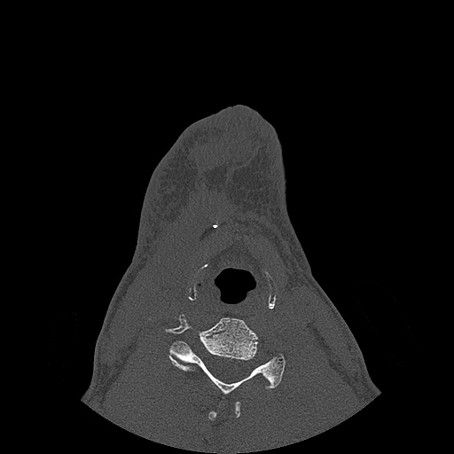
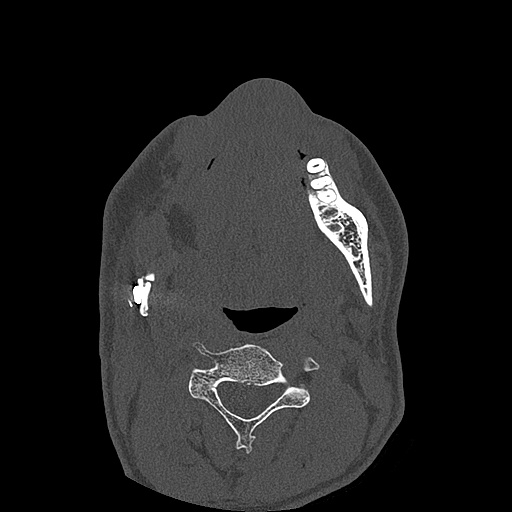
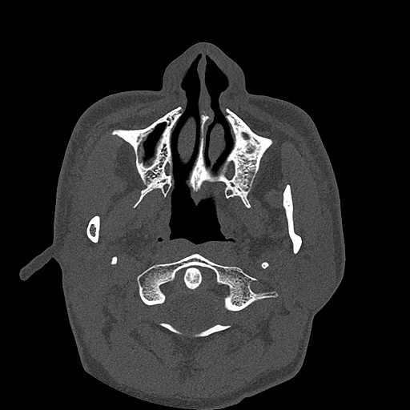
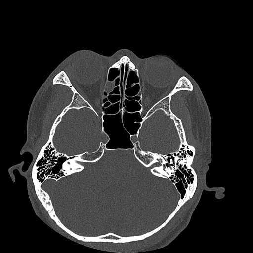
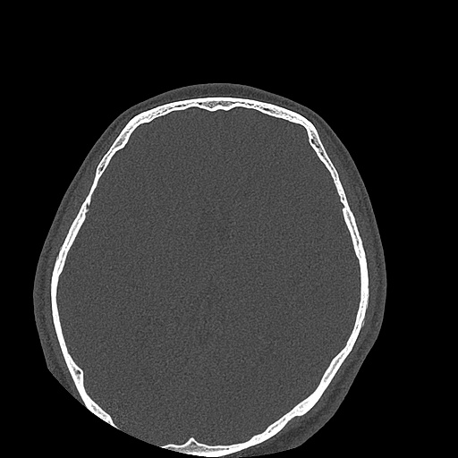

# Mandibular Bone Union Detection — Project Report

## Dataset Overview

Two separate datasets are used in this project, one for each part.

**Dataset 1 — the sample CT volume (used in Part 1).**
This is one full CT scan of one patient, provided as a DICOM series: a folder of 321
individual image files (`ct_sample/DICOM/`), one file per thin cross-sectional slice
through the patient. Stacked together in the right order, these 321 slices form a
single 3D picture of the patient's head and neck.

**Dataset 2 — the annotated slice dataset (used in Part 2).**
This is a curated set of 820 individual CT slice images (`dataset/images/`, JPGs),
each with a matching text file (`dataset/labels/`) marking where the osteotomy
site(s) — the graft-to-jaw joins — appear in that slice, as a bounding box. Unlike
Dataset 1, these slices are not one continuous scan: they are hand-picked slices
pulled from **85 different patients** across **160 scanning sessions** (a patient may
have been scanned several times during recovery), keeping only the slices that
actually show a join. The filename of each image records exactly where it came from,
e.g. `920_1_43.jpg` = patient `920`, scanning session `1`, slice `43`. This is the
dataset the detection model is trained and evaluated on.

A more detailed, code-backed breakdown of each dataset follows in section 1.2 (Dataset
1) and section 4.3 Task 1 (Dataset 2).

---

## Part 1 — Understanding the CT Data

### 1.1 Anatomical Viewing Planes

A CT scanner takes many thin X-ray "slices" through the body and stacks them into a 3D
volume. That volume can then be sliced back apart and viewed from three standard
directions, called anatomical planes. Each one cuts the body a different way and shows
a different cross-section.

**Axial plane (also called transverse or horizontal plane)**
Cuts the body horizontally, separating **top (superior)** from **bottom (inferior)**.
Think of it as slicing a loaf of bread into round slices while it lies on its side —
each slice is a flat "disc" through the body at one height. Looking at an axial slice
of the jaw is like looking down at the patient from above: you see a cross-section
through the mandible, with the left and right sides of the jaw visible in the same
image, roughly forming a horseshoe shape. This is the orientation the provided CT
volume is stored in, and it is the standard view used to inspect the osteotomy sites,
since a single axial slice can show the graft and the native bone sitting side by side.


**Coronal plane (also called frontal plane)**
A vertical cut that separates **front (anterior)** from **back (posterior)**. Imagine
slicing the body from ear to ear, top to bottom, like a slice through a loaf of bread
standing on its end, cut from the front face. A coronal image of the jaw looks like a
view of the face with the front and back layers stacked, useful for seeing how the
upper and lower jaw line up vertically, or how the left and right sides compare in
height.


**Sagittal plane**
Also a vertical cut, but perpendicular to the coronal plane: it separates **left**
from **right**. A cut straight down the middle (nose to the back of the head) is
called the mid-sagittal plane, splitting the body into two symmetric halves; any
parallel cut off-center is called a para-sagittal plane. A sagittal image of the jaw
gives a "profile" view, showing the front-to-back shape of the mandible at one
left-right position.


**How the three relate to each other**
The three planes are mutually perpendicular — each one is at a right angle to the
other two, similar to the x, y and z axes of a 3D coordinate system. A CT volume is
essentially a 3D grid of intensity values, and choosing to view it as axial, coronal,
or sagittal is just a choice of which axis to slice along; no data is added or lost,
only the viewing direction changes.

*(Images to be inserted — planes diagram)*

---

### 1.2 Analysis of the Provided CT Volume

*(Full code in `notebooks/part1_ct_analysis.ipynb`.)*

**Loading.** The provided sample is a DICOM series (`ct_sample/DICOM/`, 321 `.dcm`
files, one per axial slice). Each file was read with `pydicom`, the slices were sorted
by their `ImagePositionPatient` z-coordinate (not by filename, since DICOM filenames
are not guaranteed to sort into anatomical order), and stacked into a single 3D NumPy
array. Raw pixel values were converted to Hounsfield Units (HU) using each slice's
`RescaleSlope`/`RescaleIntercept`.

**Shape.**
```
Volume shape: (321, 512, 512)
```
The first dimension (321) is the number of axial slices; the second and third (512,
512) are the height and width of each slice in pixels. In-plane pixel spacing is
0.43 x 0.43 mm and the spacing between slices is 0.5 mm, so the volume is a fine-grained
3D grid of roughly 0.43 x 0.43 x 0.5 mm voxels.

**Number of slices.** 321 axial slices, as reported above.

**Min / max intensity.**
```
Minimum intensity: -16040 HU
Maximum intensity: 32767 HU
```
Neither value corresponds to real anatomy. Normal HU ranges from about -1000 (air) to
a few thousand (dense bone/metal). 32767 is exactly the maximum value representable in
a 16-bit signed integer (2^15 - 1), which indicates pixel saturation/clipping rather
than a genuine tissue reading — most likely caused by metal artifact around the
fixation plates and screws. -16040, far below even air, is characteristic of a padding
value the scanner writes into pixels that fall outside the actual circular scan field
(the corners of the square image array that were never physically measured). This is a
useful reminder that the raw min/max of a CT volume describes artifacts and padding at
its edges, not the anatomy of interest, and that any downstream processing should clip
or window the HU range (e.g. to roughly [-1000, 3000]) rather than trust the raw
extremes.

**Representative slices.** Five slices, evenly spaced through the volume (indices 0,
80, 160, 240, 320), were exported as JPGs. Before export, each slice was windowed
(clipped to a bone window of center 400 HU / width 1800 HU, then rescaled to 0-255)
rather than using the raw HU range, since the raw min/max found above is dominated by
padding and saturation and a naive rescale would make the JPGs look almost entirely
black. The five slices sweep through most of the head and neck: slice 0 is at the level
of the neck (a cervical vertebra is visible), slice 80 sits lower in the region where
the mandible and its fixation hardware would be expected — a small bright irregular
structure is visible on one side, consistent with a metal plate/screw — and slices 160,
240 and 320 move upward through the skull base and into the brain. This confirms the
provided sample volume spans a broad head-and-neck region rather than being tightly
cropped to the jaw alone.

| Slice 0 | Slice 80 |
|---|---|
|  |  |

| Slice 160 | Slice 240 | Slice 320 |
|---|---|---|
|  |  |  |

---

## Part 2 — Osteotomy Site Detection Pipeline

### 4.3 Task 1 — Dataset inspection and summary

*(Full code in `notebooks/part2_dataset_inspection.ipynb`.)*

**Images and labels.** The dataset contains 820 JPG images in `dataset/images/` and 820
label files in `dataset/labels/`, matched one-to-one by filename with no orphans on
either side.

**Patients and sessions.** Parsing the `patientID_sessionNumber_sliceNumber` filename
convention gives:
- **85 unique patients**
- **160 unique (patient, session) pairs**, i.e. 160 distinct imaging sessions
- Sessions per patient: 31 patients have 1 session, 34 have 2, 19 have 3, and 1 patient
  has 4.

**Images are not evenly distributed across patients.** Images per patient range from 1
to 123 (mean 9.6, median 5), and the distribution is heavily skewed: the top 5 patients
alone (`8`: 123, `3`: 112, `18`: 65, `500`: 30, `403`: 28) contribute 358 of the 820
images — about 44% of the whole dataset from just 5 of the 85 patients. This is an
important constraint on how the train/validation/test split must be built (see Task 2
below): a naive random image-level split risks leaking near-duplicate slices from the
same patient across splits, and even a random patient-level split risks one of these
heavy patients dominating whichever split it lands in.

**Annotations.** Every label file uses the YOLO box format (`class x_center y_center
width height`, normalized 0-1) with a single class (`0`, the osteotomy site). Box count
per image: 1 image has 0 boxes, 605 have 1, 140 have 2, 72 have 3, and 2 have 4, for
1109 annotated boxes in total. Almost every provided slice contains at least one
positive annotation — consistent with the project brief stating that the relevant
slices were pre-selected from the full volumes, rather than this being a realistic
prevalence of positives vs. negatives in a full scan. Images with 2+ boxes reflect
slices that catch more than one osteotomy site at once (e.g. both sides of a
bilateral reconstruction, or multiple graft segments).

### 4.3 Task 2 — Train / validation / test splits

*(Full code in `notebooks/part2_dataset_inspection.ipynb`.)*

**Splitting by patient, not by image.** Every image belonging to a given patient
(across all of that patient's sessions) is assigned entirely to one split. Splitting
by image instead would let near-identical slices of the same join — adjacent slice
numbers, or the same join re-scanned at a later follow-up session — end up in both
training and test, letting the model partially "recognise" a specific patient's
anatomy or hardware rather than genuinely learning to localise osteotomy sites, and
inflating the reported test performance.

**Balancing around the skew.** As shown in Task 1, images per patient are heavily
skewed (1 to 123). A plain random assignment of whole patients to splits is risky at
this scale (85 patients): a single unlucky draw could put a 100+ image patient
entirely into test and badly distort the intended split proportions. To avoid this,
patients are assigned with a greedy largest-first heuristic targeting a 70/15/15
split by image count: patients are shuffled (fixed seed = 42, for reproducibility),
sorted by image count descending, and each is assigned in turn to whichever split is
currently furthest below its target share of total images.

**Result.**
```
train: 35 patients, 574 images (70.0%)
val:   25 patients, 123 images (15.0%)
test:  25 patients, 123 images (15.0%)
```
Because train's 70% target starts out with by far the largest deficit, the greedy
assignment naturally absorbs essentially all of the heaviest patients (`8`, `3`,
`18`, `500`, `403`, ...) into train first. The practical effect is a useful one: val
and test end up composed of many small, diverse patients rather than being dominated
by one or two — the largest single-patient contribution to val is 11 images, and to
test is 10 — which makes both a more meaningful measure of how well the model
generalises to unseen patients, rather than a score dominated by one patient's slices.
The resulting patient -> split mapping is saved to `dataset/splits.json` so the same
split is reused for both training and evaluation.

### 4.3 Task 3 — Train a detection model

*(Full code in `notebooks/part2_train.ipynb`.)*

**Framework and model.** Ultralytics YOLOv8 was used, starting from the COCO-pretrained
`yolov8n` checkpoint (the smallest YOLOv8 variant). This choice was made because: the
provided labels are already in YOLO's normalized box format, so no annotation
conversion was needed; the dataset is small (574 training images from 35 patients),
which favours transfer learning from a pretrained backbone over training a detector
from random weights; and it is a single-class, small-object task, which YOLO's
architecture handles well. Images were used at their native 512x512 resolution.

**This task was not completed to a real trained model, due to a hardware/time
constraint discovered during setup.** This machine has no GPU (CPU-only PyTorch). A
timed, full-configuration 1-epoch run measured **~122 seconds per epoch**. A proper
training schedule (on the order of 100 epochs with early stopping, as would normally
be used for a dataset this size) would therefore take on the order of **3-4 hours**,
which was not available in the time given for this submission.

**What was verified instead.** Rather than leave the pipeline unproven, a single
1-epoch proof-of-concept run was executed end-to-end (data loading and augmentation,
the YOLOv8 training loop, loss computation, and validation), with plotting disabled so
that no dataset images would be embedded in the saved run artifacts (this dataset must
not be redistributed, and Ultralytics' default plots save training/validation image
mosaics). Within that single epoch, the training losses decreased consistently across
all 36 batches:
```
box_loss: 4.945 -> 3.898
cls_loss: 7.823 -> 6.866
dfl_loss: 3.089 -> 1.836
```
This confirms the pipeline is functionally correct end-to-end and that gradients are
flowing (the model is fitting to the data), but one epoch is nowhere near enough
training for a usable detector — the resulting validation mAP50 was effectively zero
(~1.3e-6), as expected this early, especially given YOLO's learning-rate warmup and
mosaic augmentation schedule are tuned for a much longer run. The weights produced by
this run are not evaluated further, since they do not represent a meaningfully trained
model.

### 4.3 Task 4 — Evaluation and analysis

**Not completed**, as a direct consequence of Task 3: without a properly trained
model, there is no meaningful evaluation to report. Had training completed, the plan
was to report standard detection metrics (precision, recall, mAP50 and mAP50-95) on
the held-out test split defined in Task 2, broken down overall and, given the box-count
distribution found in Task 1, separately for single-box vs. multi-box images, to check
whether the model handles slices with more than one osteotomy site as reliably as the
more common single-site slices.

### 4.3 Task 5 — Qualitative results

**Not completed**, for the same reason as Task 4: there is no meaningfully trained
model to draw predictions from, so overlaying predicted vs. ground-truth boxes would
not be an informative comparison. The data-loading and box-denormalization logic
needed to produce such overlays is already in place from Tasks 1-3 and would only
need a trained checkpoint to be used.

---

## Discussion Questions

### Limitations

- **No GPU access.** Training is CPU-only on this machine (~122s/epoch measured), so a
  full run (~100 epochs, several hours) was infeasible in the time available. Tasks 4
  and 5 (evaluation and qualitative results) could not be produced against a real
  trained model as a result.
- **2D, per-slice detection discards 3D continuity.** The pipeline detects boxes
  independently on each slice, with no mechanism to use the fact that the same
  osteotomy site is almost certainly also present on the adjacent slices.
- **Small, patient-imbalanced dataset.** 820 images come from only 85 patients, and 5
  of those patients supply about 44% of the images (Task 1), so the effective
  diversity is much lower than the image count suggests - this had to be handled
  explicitly when constructing the split (Task 2).
- **Raw CT data quality issues.** Part 1's analysis found the volume's raw intensity
  range to be **-16040 HU to 32767 HU**, far outside the physiological range (roughly
  -1000 HU for air up to a few thousand HU for dense bone/metal). The maximum,
  32767, is exactly 2^15 - 1, the largest value an int16 pixel can hold, indicating
  saturation/clipping rather than a real reading - most likely metal artifact around
  the fixation hardware. The minimum, -16040, is far below even air and is
  characteristic of a padding value written into pixels outside the scanner's actual
  circular field of view. Neither extreme reflects real anatomy, so any downstream
  processing needs to explicitly clip/window the HU range (this project used a bone
  window of center 400 HU / width 1800 HU) rather than trust the raw min/max.

### Improvements

- **Use a GPU.** This alone unblocks everything else - a real training run, then the
  evaluation and qualitative results this submission is missing.
- **Show the model neighbouring slices, not just one.** An osteotomy site spans
  several slices, but the model currently looks at each slice alone. Feeding it a
  slice plus its neighbours would let it use that context instead of ignoring it.
- **Collect more patients, not just more slices.** 5 of 85 patients make up 44% of
  the data. More slices from the same few patients won't fix that - more *patients*
  will.
- **Clip the HU values before training.** The raw scans contain padding and
  metal-artifact values far outside real tissue range. Clipping to a fixed window
  (as done for the exported sample slices) before training, instead of hoping the
  model learns to ignore them, should give cleaner input data.

---

## Short Survey

- How interested are you in computer vision? (0-5): 3
- How interested are you in medical image processing? (0-5): 4
- How interested were you in this project? (0-5): 5
